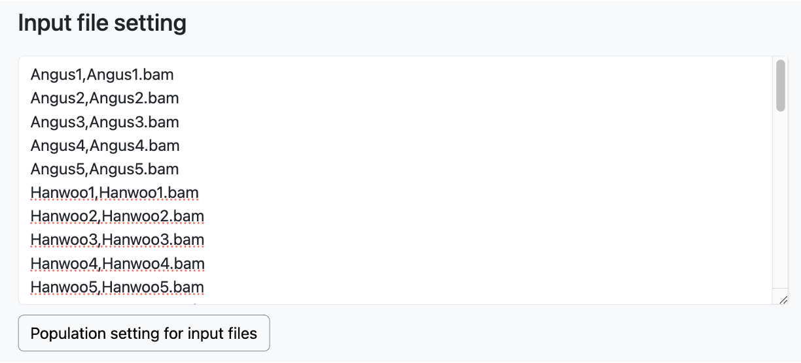

# Documentation for Parameter File Generation Webpage

PAPipe alleviates the effort of creating complex parameter files by providing a webpage for generating parameters.

[PAPipe Parameter generator](http://bioinfo.konkuk.ac.kr/PAPipe/parameter_builder/index.html)

- The Parameter Generator webpage is also intuitive and easy to understand.
- By checking the items and placeholders on the webpage, you can easily complete the writing and input the parameters required for execution without much difficulty.
- The 'Load parameter for test data' button at the top imports inputs that can generate the same parameter file as provided in the tutorial data, displaying it on the webpage for users to review and easily follow along.
- Clicking the 'Clear' button allows you to erase and reset the entire input.
- Most of the input form on the webpage is pre-filled with default values, which users can modify as needed.
- The section that takes the file name as input automatically generates the path within the Docker container when you enter the file name, not the full path.

### Global parameters

- This is the section where parameters required for the global execution of the pipeline are received.

### Population setting

- In this section, the input is taken for the complete population list to be used in the analysis.
- Enter one population name per line.

### Begin analysis from

- PAPipe can provide different pipelines depending on the level of data users have.
- Depending on the data level, ranging from raw reads to variant calls, clicking the respective selection box will display the necessary input fields for each.
- 'From read QC or mapping' step requires pairwise read files per sample

- 'From variant calling' step requires single alignment file per sample

- 'From population genetic analyses' step requires variant file and sample information

### Population setting for input files

- After entering the necessary file names and sample information, clicking the 'Population Setting for Input Files' button generates a table that includes sample-specific information and select boxes for assigning population and sex information.
- Users can assign the groups to which the entered samples belong and specify the gender of each sample within this table.
- Users can directly modify the select box for each row, or they can select multiple rows, click the 'Apply Population' or 'Apply Sex' button at the bottom, and modify information for multiple sample data entries.
- Clicking on a specific row in the table will make it bold, indicating that the row is selected. If you hold down the shift key while clicking on the next row you want to select, all rows in the range between the two clicked rows will be selected. You can then apply specific population information using the 'Apply Population' button and assign specific sex information using the 'Apply Sex' button for the selected range.

- In the example below, if you choose 'None' in the bottom selection box for the selected rows and click the 'Apply Sex' button, you can modify the gender values for all selected rows from 'Female' to 'None'.

### Parameter settting

- After completing the input files and population setting, you can select or modify the parameters necessary for pipeline execution.
- The parameters for the pipeline that need to be entered depend on the selected 'Begin analysis from' option at the top. This is automatically reflected on the webpage, eliminating the need for the user to consider this manually.
- PAPipe provides two options for read alignment and three options for variant calling. While PAPipe offers default execution, it also caters to users requiring advanced options by providing input forms for detailed parameters at each step.

### Population genetic analysis

- PAPipe supports 11 population genetic analyses. Users can selectively choose and execute the analyses they need during the analysis.
- Upon selecting each analysis, a user-customizable parameter input form for conducting that specific analysis appears.
- The form is typically pre-filled with default values for program execution.

### PAPipe-extension

**Drawing PCA plot until objective variance**

- PAPipe generates PCA plots for all pairwise PC pairs that can be created using all the PCs reaching the target variance.
- User can set the target explained variance using parameters such as 'Objective sum of the proportion of variance explained (%)' or 'Max PC,' or explicitly specify the PCs used for visualization.

**Repetitive execution for several analyses**

- To facilitate comprehensive analysis, PAPipe allows for the repetitive execution of the same analysis with different parameters.
- In the Population tree analysis, when given the 'm' parameter, the analysis will be repetitively executed for values ranging from 0 to the specified 'm' parameter.

- In Population Structure Analysis, the analysis is repetitively performed for values ranging from the minimum value of 'k' (2) to the specified 'k', returning results for each iteration.

- For Linkage Disequilibrium Decay Analysis, you can provide multiple values for the 'maxdist' parameter, separated by commas. PAPipe returns results for each execution with different 'maxdist' values.

**Default Fst and user combination**

- PAPipe inherently provides various combinations of FST analysis by default.
- PAPipe performs FST analysis for all possible pairs that can be created from the entered populations.
- PAPipe also performs the analysis by targeting one specific population from all the entered populations and comparing it against the rest of the populations as a control group. This is done by default.
- In addition, if the user has specific population combinations they want to compare, they can use the 'User Setting' at the bottom to add them.

### Clicking Generate paramter files button and get generated parameter files 
- Once the necessary parameter input is complete, click the 'Generate Parameter Files' button.
- After clicking that button, two new buttons will be generated at the bottom.
- When you click the 'Click the link of parameter files' button on the left, the link to download the generated parameters using wget will be copied to the clipboard.
- When you click the 'Download parameter files' button on the right, the download of the generated parameter files will begin.

