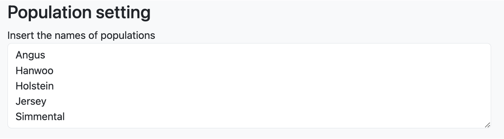
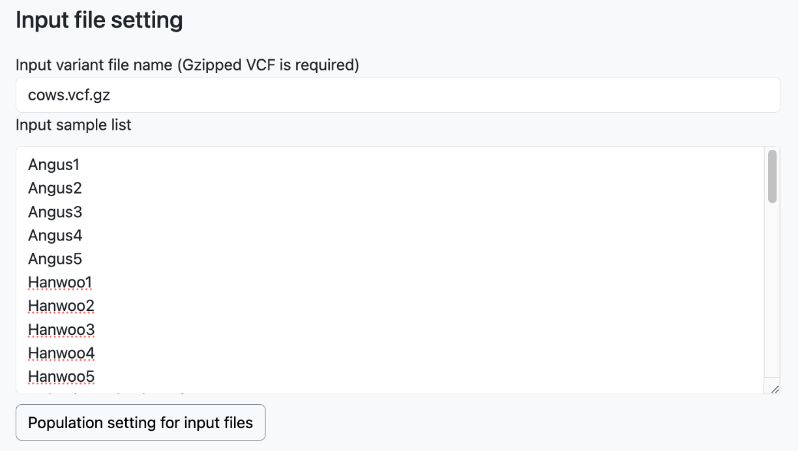
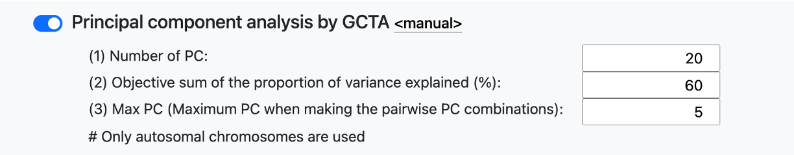

# Parameter File Generator

## Wegpage link 

[PAPipe Parameter File Generator](http://bioinfo.konkuk.ac.kr/PAPipe/parameter_builder/)

## Main web interface

## Documentation

### "Load parameter for test data" button

- Example parameter values for a test data are loaded in each field 

### "Clear" button

- Reset all parameter values 

### Global parameters

**(1) Reference genome assembly file**

- The name of a genome assembly file (gzip-compressed FASTA) of a reference species
- Example: pig.fa.gz

**(2) Reference dbSNP file (optional)**

- The dbSNP file (gzip-compressed VCF) of a reference species
- Optional parameter
- Example: pig.vcf.gz

**(3) Total number of chromosomes in the reference genome**

- Total number of chromosomes (including sex chromosomes) of in the reference genome
- Example: 23

**(4) Number of autosomes in the reference genome**

- Total number of autosomes in the reference genome
- Example: 21

**(5) Names of sex chromosomes in the reference genome (optional)**

- The list of the names of sex chromosomes in the reference genome
- Comma-separated without space
- Optional parameter
- Example: X,Y

**(6) Name of output directory**

- The name of output directory

**(7) Threads**

- The number of threads for parallel execution

### Population setting

- Names of populations
- One population name per line

### Begin analysis from

- Set the starting point of analysis
- Data in the "Input file setting" must be set differently based on the choice here

**From read QC (you have raw reads)**

- You have raw sequencing files and therefore you want to begin analysis from read QC and trimming
- In the "Input file setting" textbox, the names of a sample and its corresponding sequencing file must be given (one pair per line)
- Only paired-end sequencing data is supported, therefore for one sample, two read files (one for the first reads and the other for the second reads) must be specified in two different lines
- Sequencing files must be gzip-compressed fastq files

**From read mapping (you have trimmed reads)**

- You have trimmed sequencing files and therefore you want to begin analysis from read mapping (skip read QC and trimming)
- In the "Input file setting" textbox, the names of a sample and its corresponding sequencing file must be given (one pair per line)
- Only paired-end sequencing data is supported, therefore for one sample, two read files (one for the first reads and the other for the second reads) must be specified in two different lines
- Sequencing files must be gzip-compressed fastq files

**From variant calling (you have read mapping files)**

- You have read mapping files and therefore you want to begin analysis from variant calling (skip read QC, read trimming, and read mapping)
- In the "Input file setting" textbox, the names of a sample and its corresponding mapping file must be given (one pair per line)
- The mapping file must be a BAM file

**From population genetic analyses (you have variant calling results)**

- You have variant calling results and therefore you want to begin population genetic analyses (skip read QC, read trimming, read mapping, and variant calling)
- In the "Input variant file name" textbox, a single variant calling result file (gzip-compressed VCF file) must be given
- In the "Input sample list" textbox, a sample name must be given (one per line)

### Population setting for input files

A population name is assigned to each input data file in this part.

**Requirements**

- Population names must be given in the "Population setting" texbox as described above
- The names of samples and input files must be given in the "Input file setting" textbox as described above

**Population setting** 

- Click the "Population setting for input files" button to display the population setting table as shown above
- A population and sex information can be set for each input file separately by using the "Population" and "Sex" drop-down textbox
- A population and sex information can be set for multiple input files together by using the "Apply population" and "Apply sex" bottons and their related drop-down textbox (use mouse shift-click as described on the webpage)
- The sex information is optional and therefore leave them as "None" in that case 

### Parameter settting for read QC, read alignment, variant calling, and post processing

- Parameter values for read QC, read alignment, variant calling, and post processing can be set using textboxes shown above
- Read alignment can be done by BWA or Bowtie 2
- Variant calling can be done by GATK3, GATK4, or BCFtools
- Additional parameters can be set by clicking "Additional user parameters (optional)"
- The description of available parameters can be obtained by clicking the "manual" link 

### Population genetic analysis

- A total of 11 population genetic analyses can be simultaneously run by using the on/off button shown above

### Parameter setting for population genetic analysis

- The description of most parameters can be found from the manual page of each tool (click the "manual" link)
- The description of parameters generated by PAPipe are shown below

**Principal component analysis**

- Number of PC: the total number of PCs generated by this analysis
- Objective sum of the proportion of variance explained (%): the cutoff value of the sum of the proportion of variance explained (PVE), only top PCs that their PVE sum satisfies this cutoff are used
- Max PC: only this number of top PCs are used to create the PCA plots between two PCs

**Fixation index analysis**

- By default, the fixation index is calculated for the following population combinations
    - For all possible pairs of two populations
    - For one population against all others 
- Specific pairs of populations can be set by using "Additional user setting for population combinations (optional)"

### Generate paramter files

- Click the "Generate parameter files" button after all parameters are set
- Two new buttons will be generated
    - "Copy the link of parameter files": the link of a gzip-compressed tar file is copied to clipboard (you can use this link to download the file directly to your Linux machine using the "wget" command)
    - "Download parameter files": a gzip-compressed tar file is downloaded directly to your computer
  
