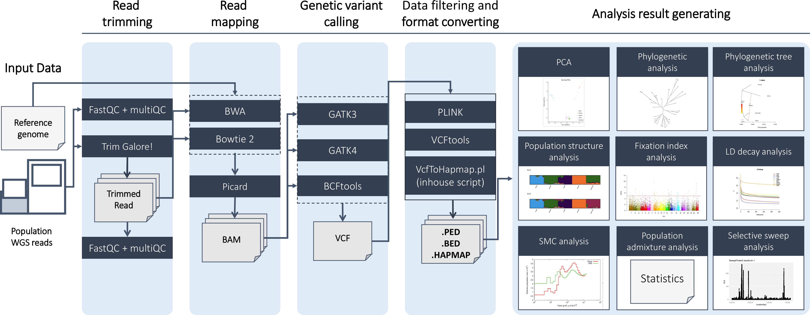

## PAPipe


 A comprehensive pipeline for population genetic analysis containing Read mapping, Variant calling, and Population genetic analysis




### Main workflow

1. Raw read trimming
    1. Trim galore!

2. Read mapping (Two options)
    1. BWA
    2. Bowtie2

3. Variant calling (Three options)
    1. GATK3
    2. GATK4
    3. BCFtools call

4. Postprocessing

5. 11 popular Population genetic analysis 
    1. principal component analysis (Plink 1.9)
    2. PCA projection analysis (Plink 2)
    3. Phylogenetic analysis (Snphylo)
    4. Treemix analysis (Treemix2)
    5. Population structure analysis (Structure)
    6. Linkage disequilibrium decay analysis (PopLDdecay)
    7. Selective sweep finding analysis (SweepFinder2)
    8. Population admixture analysis (Admixtools)
    9. Pairwise sequentially Markovian coalescent analysis (PSMC)
    10. Multiple sequentially Markovian coalescent analysis (MSMC)
    11. Fixation index analysis (Fst)

### Install PAPipe

```bash
git clone https://github.com/jkimlab/PAPipe.git
```

### Requirements

---

- You can prepare the environment in local with the commands below
    
    ```bash
    cd ./Programs/
    bash ./set_local_env.sh
    ```
    
    This commands will automatically install the requirements and print the paths can be used as parameter file directly 
    
- Or you can use PAPipe on docker without having to prepare the environment.
    → [How to use PAPipe on docker](https://github.com/nayoung9/PAPipe#using-docker)  
    
- Check out [Requirements](https://github.com/nayoung9/PAPipe/tree/main/Requirements) for details

### Run PAPipe

**Using local environment**

```bash
/Path_to_PAPipe/Programs/bin/main.py -p main.param.txt -s main.sample.txt - -o OUTDIR
```

**Using Docker**

```bash
# Change directory where Dockerfile exists 
cd ./Programs

# Build Docker image
docker build -t [docker image name] ./ &> log_image_build

#Run
docker run -v [Local directory containing data]:[Path of connecting directory on container] -it [docker image name]
/Path_to_PAPipe/Programs/bin/main.py -p main.param.txt -s main.sample.txt - -o OUTDIR
```

→ You can generate the parameter file easily at here : [PAPipe Parameter genetator](http://bioinfo.konkuk.ac.kr/practice/nayoung/PAPipe/parameter_builder/jm_index5.html)

→ Check out more details about parameter files : [Tutorial](https://github.com/nayoung9/PAPipe/tree/main/Tutorial)

### Results of PAPipe

1. Trimmed read data 
    - Trimmed read data for all samples
        
        ```
        /Path_to_out_directory/00_ReadQC/TrimmedData/[sample]_1_val_1.fq.gz
        /Path_to_out_directory/00_ReadQC/TrimmedData/[sample]_2_val_2.fq.gz
        ```
        
    - fastQC results for all samples before and after trimming
        
        ```
        /Path_to_out_directory/00_ReadQC/QC_Report_Before_Trimming/[population]/[sample]_1_fastqc.html
        /Path_to_out_directory/00_ReadQC/QC_Report_Before_Trimming/[population]/[sample]_2_fastqc.html
        ```
        
    - MultiQC summarized QC results for populations before and after trimming
        
        ```
        /Path_to_out_directory/00_ReadQC/QC_Report_Before_Trimming/[population]/multiqc_report.html
        ```
        
2. Read alignment data 
    - Read mapping files for all samples
        
        ```
        /Path_to_out_directory/01_readMapping/04ReadRegrouping/[population]_[sample].addRG.marked.sort.bam
        ```
        
3. Variant call data
    - Variant call generated using all population sequencing data
        
        ```
        /Path_to_out_directory/02_VariantCalling/VariantCalling/[].All.variant.combined.g.vcf.gz
        ```
        
4. Post-processed data 
    - Variant call gone through Hapmap format conversion/Plink filtering
        
        ```
        /Path_to_out_directory/03_Postprocessing/Hapmap/variant.combined.GT.SNP.flt.hapmap
        /Path_to_out_directory/03_Postprocessing/plink/[prefix].*
        ```
        
5. Population analysis
    1. principal component analysis (Plink 1.9)
        - PCA results
            
            ```
            /Path_to_out_directory/04_Population/[running datetime]/PCA/PCs.info
            ```
            
        - PCA plots of all available combination of two PCs
            
            ```
            /Path_to_out_directory/04_Population/[running datetime]/PCA/all.PCA.pdf
            ```
            
    2. PCA projection analysis (Plink 2)
        - PCA results
            
            ```
            /Path_to_out_directory/04_Population/[running datetime]/PCA/PCs.info
            ```
            
    3. Phylogenetic analysis (Snphylo)
        - .NEWICK formatted phylogenetic tree
            
            ```
            /Path_to_out_directory/04_Population/[running datetime]/SNPhylo/snphylo.ml.txt
            ```
            
        - Visualized phylogenetic tree
            
            ```
            /Path_to_out_directory/04_Population/[running datetime]/SNPhylo/snphylo.ml.png
            ```
            
    4. Treemix analysis (Treemix2)
        - Treemix results in a single PDF file
            
            ```
            /Path_to_out_directory/04_Population/[running datetime]/Treemix/Treemix.results.pdf
            ```
            
    5. Population structure analysis (Structure)
        - STRUCTURE results per K in .PNG files and all STRUCTURE results in a single PDF file
            
            ```
            /Path_to_out_directory/04_Population/[running datetime]/STRUCTURE/CLUMPAK/K=[n].MajorCluster.png        
            ```
            
        - STRUCTURE results for all K in single .PDF file
            
            ```
            /Path_to_out_directory/04_Population/[running datetime]/STRUCTURE/CLUMPAK/pipeline_summary.pdf
            ```
            
    6. Linkage disequilibrium decay analysis (PopLDdecay)
        - Linkage disequilibrium decay results for each maximum distance parameter
            
            ```
            /Path_to_out_directory/04_Population/[running datetime]/LdDecay/[maxDist]/Plot/out.pdf
            ```
            
    7. Selective sweep finding analysis (SweepFinder2)
        - Selective Sweep results in point plot figures for all chromosom generated per population
            
            ```
            /Path_to_out_directory/04_Population/[running datetime]/SweepFinder2/[population]/SweepFinderOut.pdf
            ```
            
        - Selective Sweep results per population and per chromosome
            
            ```
            /Path_to_out_directory/04_Population/[running datetime]/SweepFinder2/[population]/[population].[chromosome].SF2out
            ```
            
    8. Population admixture analysis (Admixtools)
        - Admixture analysis results
            
            ```
            /Path_to_out_directory/04_Population/[running datetime]/ADMIXTOOLS/admixtools_3pop/result.out
            /Path_to_out_directory/04_Population/[running datetime]/ADMIXTOOLS/admixtools_4diff/result.out
            /Path_to_out_directory/04_Population/[running datetime]/ADMIXTOOLS/admixtools_f4stat/result.out        
            /Path_to_out_directory/04_Population/[running datetime]/ADMIXTOOLS/admixtools_Dstat/result.out
            ```
            
    9. Pairwise sequentially Markovian coalescent analysis (PSMC)
        - Effective Size plot
            
            ```
            /Path_to_out_directory/04_Population/[running datetime]/EffectiveSize/psmc_plot.pdf
            ```
            
    10. Multiple sequentially Markovian coalescent analysis (MSMC)
        - Effective Size plot
            
            ```
            /Path_to_out_directory/04_Population/[running datetime]/MSMC/MSMC.pdf
            ```
            
    11. Fixation index analysis (Fst)
        - Fixation index results visualized in manhatton plot figures
            
            ```
            /Path_to_out_directory/04_Population/[running datetime]/Fst/[pair information]/Fst_result.pdf
            ```
            
        - Significant regions results of Fst analysis
            
            ```
            /Path_to_out_directory/04_Population/[running datetime]/Fst/[comparing pair information]/[comparing pair information].sig.region.txt
            ```
