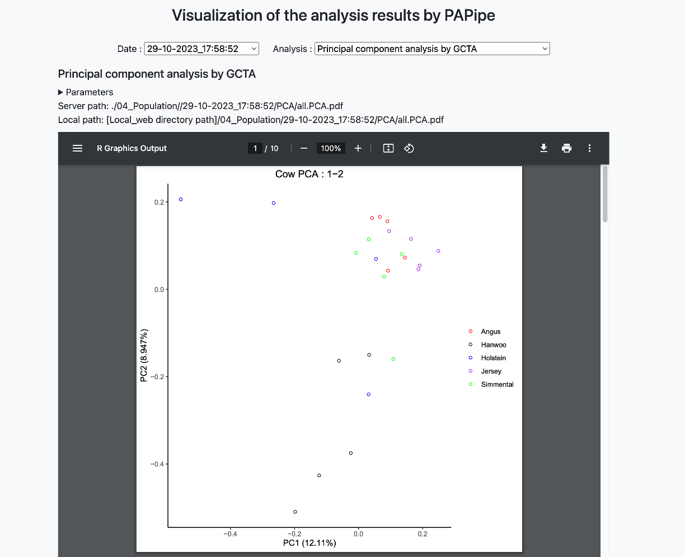
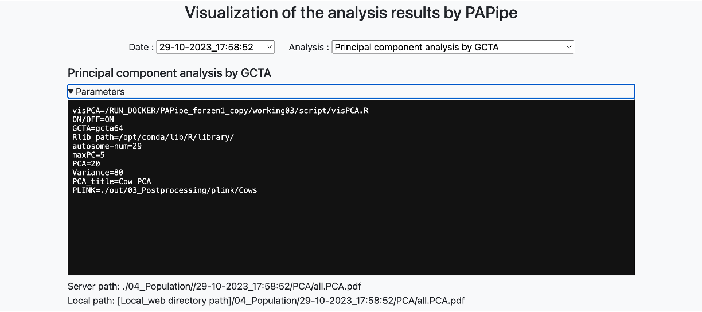

# Results browser

### Generate the Result browsing webpage

After the analysis, PAPipe can generate an HTML webpage for users to browse their results easily.

Following commands generate a directory named “web” under [path to output directory].

```bash
# RUN on docker container
perl /PAPipe/bin/html/webEnvSet.pl [path to output directory] &> webenvset.log
cd [path to output directory]/web/
perl /PAPipe/bin/html/prep_html.pl ./ &> ./webgen.log
```

Then, retrieve the <web> directory created within the server where the pipeline was executed and bring it to the user's local environment.

The example below shows SCP usage. 

It is also acceptable to use other SSH terminal file  transfer programs such as Filezila or WinSCP. 

Additionally, if you can open and view the HTML file within the user's server environment, there is no need for a separate file copy.

```bash
# Run on the local terminal 
# For example (using scp): 
scp user@host_address:[web directory path in server] [proper local path to download the population analysis results]
```

### Explore the Result browsing webpage



The PAPipe Result browsing webpage is very intuitive.

PAPipe assumes the repetitive execution of population genetic analysis with various arguments using the same input. When executing a population genetic analysis, it takes the date at the execution time as the directory name and creates results accordingly. Therefore, users can review all the results from multiple executions with different parameters on this webpage.

Below the title, there are two select boxes for selecting the execution date and the analysis. Upon selecting each, you can retrieve the parameter file and results used in the analysis.



The parameters used during program execution are initially hidden, and clicking the corresponding button reveals the options and details used during the execution.

Below the parameter information, webpage provides both server-side, execution location path or webpage based relative path of the results allowing users to easily verify the exact location of specific results.
