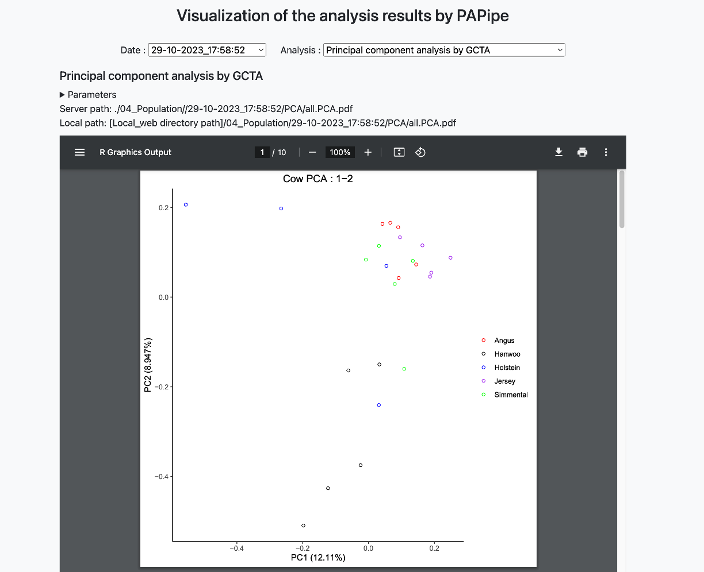
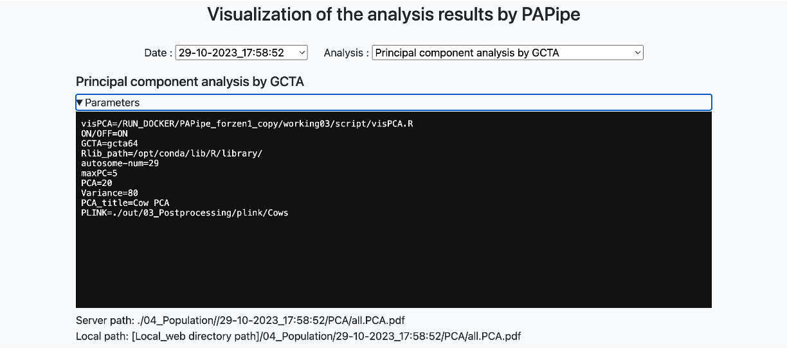

# Analysis result browser

**"Date" drop-down box**

- PAPipe can be run multiple times with different parameter settings, and can generate analysis results into the same output directory
- In this case, PAPipe create a sub-directory with a date for its name for each run, and stores analysis results in that sub-directory
- By using this drop-down box, user can navigate analysis results generate at different time point

**"Analysis" drop-down box**

- By using this drop-down box, user can select a specific analysis and visualize the result
- Only the analysis performed at each time point can be seen and selected in this drop-down box

**Parameter section**

- Parameter values used for this analysis can be seen by clicking the "Parameters"
- The following example shows the parameter values used for the principal component analysis

- The paths of generated files are also provided below the parameter section

